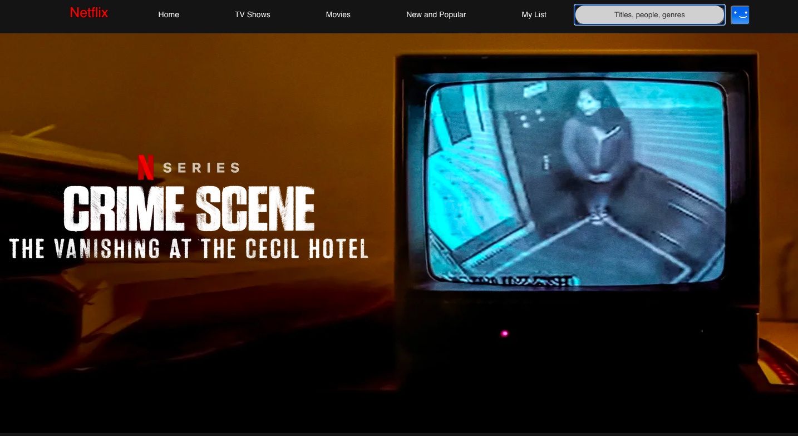
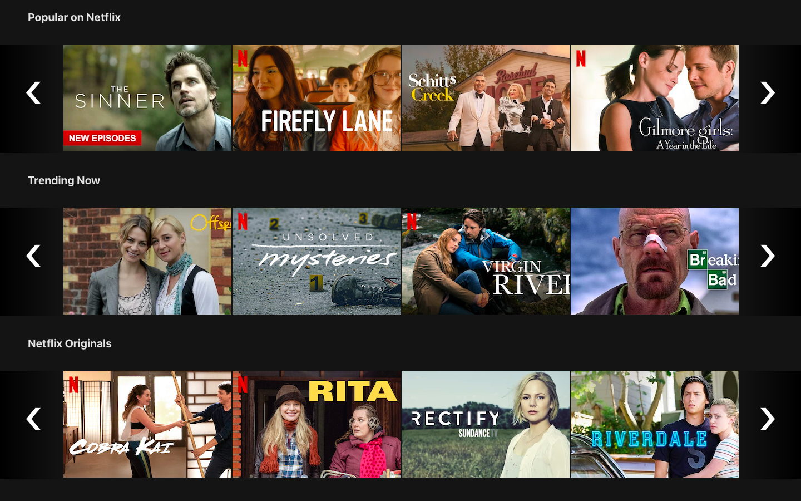
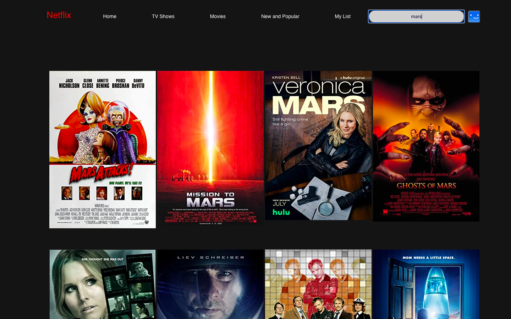

# Netflix

A Netflix clone site with dynamic search features

## Table of Contents
* [Description](#description)
* [Screenshots](#screenshots)
* [Technologies](#technologies)
* [Setup](#setup)
* [Features](#features)
* [Status](#status)

## Description

I built a Netflix clone site using React that replicates the landing page and core search functionality. The web app displays top shows and allows users to search for titles, actors, and genres. Since Netflix's API is private, the search feature pulls data from the free and open-source OMDB API. The site is responsively designed to display on a range of screens from large monitors to tablets to mobile phones.

## Screenshots
 

*Landing Page*  

 

*Top Shows*

 

*Search*

 

## Technologies

* React
* Node.js
* Javascript
* OMDB API

## Setup
Boot up Netflix with `npm start` or `yarn run start`. Replace the API key in Api.js with your OMDB api key.

## Features

* Displays top shows on Netflix by category
* Searches the OMDB database for shows by titles, people, and genres 
* Responsively designed to display on a range of devices

## Future Development

* Allow users to save watchlists of shows
* Fetch and display additional show data
* Store user profiles and showlists to a database